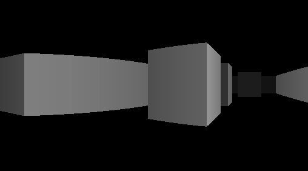
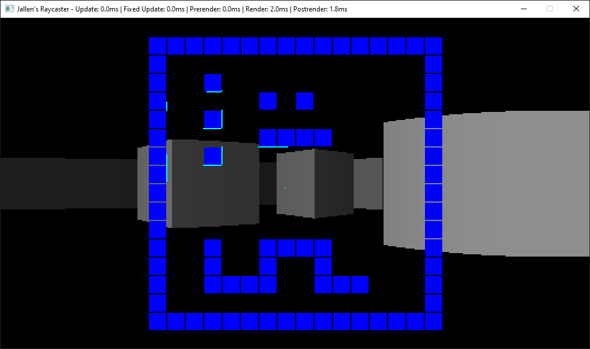

# Raycaster
A WIP Raycaster written in C#.

Current functionality is that it can render untextured walls. If you hold RMB you can look around with the mouse and move with WASD.

Holding Space will display a top down display of the level for debug purposes. You can see the solid walls in blue, the camera position as a green dot, and surfaces which the camera can sees in cyan.

